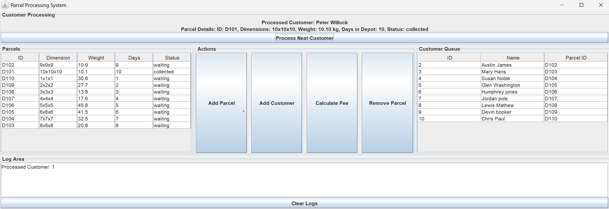
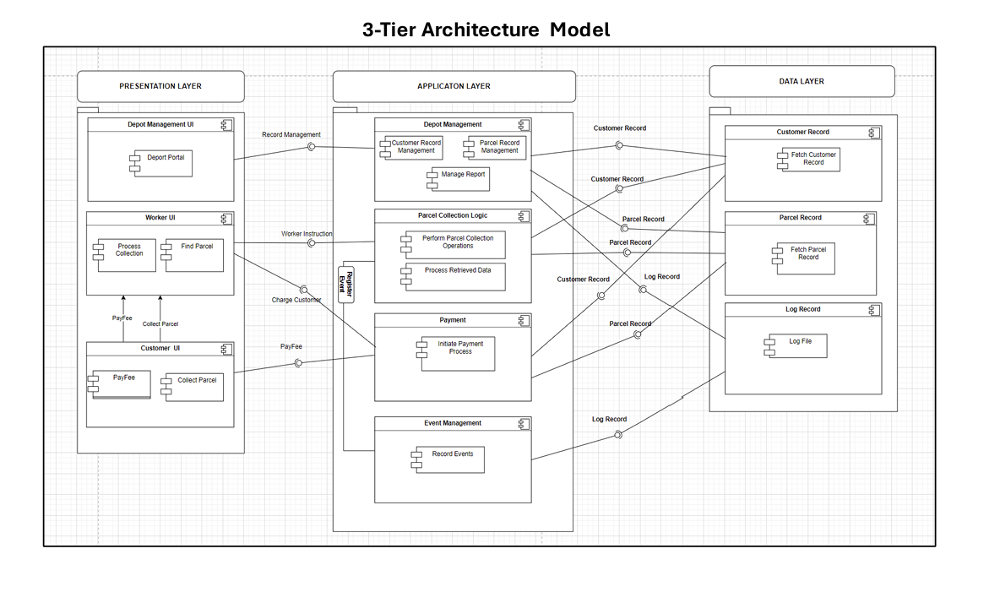
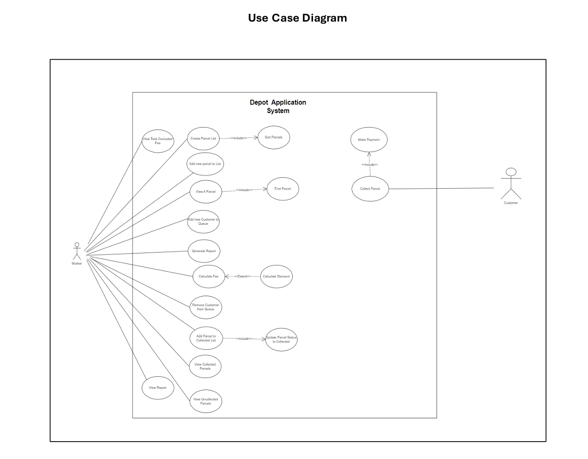
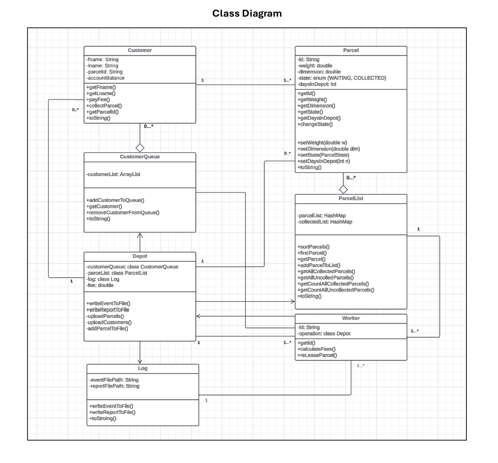

# Depot Application System

A desktop application for managing parcel collection at a depot, built in **Java** using a clean **three-tier architecture** with **MVC**, **Singleton logging**, and a **JavaFX** graphical interface.



## Overview

The Depot Application System models a real-world parcel collection workflow, separating concerns across presentation, logic, and data layers. The project was built to demonstrate solid software architecture and design principles, from requirements analysis through to implementation, rather than just feature delivery.

**Key engineering highlights:**
- Translated user requirements into formal specifications using use-case modelling and UML class diagrams before writing any code
- Designed a three-tier architecture (Presentation → Logic → Database) to keep responsibilities decoupled and the codebase maintainable
- Applied the **MVC pattern** within the presentation layer and a **Singleton logger** for centralized, consistent application logging
- Built an interactive GUI using **JavaFX**
- Managed the full development workflow with **Git**, with technical decisions documented throughout

## Architecture

The system follows a three-tier model, where each layer has a single, well-defined responsibility:

| Layer | Responsibility |
|---|---|
| **Presentation** | Displays the JavaFX graphical interface and forwards user commands to the logic layer |
| **Logic** | Acts as the bridge between presentation and data; processes requests, applies business rules |
| **Database** | Handles reading and writing of stored data files |
| **Main** | Entry point that wires up and launches the application |

### 3-Tier Architecture Model


### Use Case Diagram


### Class Diagram


## Design Patterns Used

- **MVC (Model-View-Controller)** — separates the GUI from application logic for easier maintenance and testing
- **Singleton** — ensures a single, shared logging instance across the application, providing consistent log output without duplicated state
- **Layered/Tiered Architecture** — enforces clear boundaries between presentation, business logic, and data access

## Tech Stack

- **Language:** Java
- **GUI Framework:** JavaFX
- **Version Control:** Git
- **IDE:** IntelliJ IDEA
- **Modelling:** UML (Use Case & Class Diagrams)

## Getting Started

### Prerequisites
- Java JDK 17+ (or your project's target version)
- JavaFX SDK (if not bundled with your JDK)
- IntelliJ IDEA (recommended) or any Java-compatible IDE

### Running the Application
```bash
git clone https://github.com/<your-username>/depot-application-system.git
cd depot-application-system
```

Open the project in IntelliJ IDEA and run the `Main` class to launch the application.

## Project Structure
```
depot-application-system/
├── src/
│   ├── presentation/    # JavaFX views & controllers (MVC)
│   ├── logic/           # Business/service layer
│   ├── database/        # Data access & file persistence
│   └── Main.java        # Application entry point
├── docs/
│   ├── use-case.png
│   ├── class-diagram.png
│   └── 3-tier-model.png
└── README.md
```

## What I Learned

This project reinforced how foundational architectural decisions made early in the design process directly affect how maintainable and extensible a codebase becomes. Working through formal requirement analysis and UML modelling before implementation also helped bridge the gap between software design theory and a working, tested Java application.

## Author

**[Ubong Udoette]**
